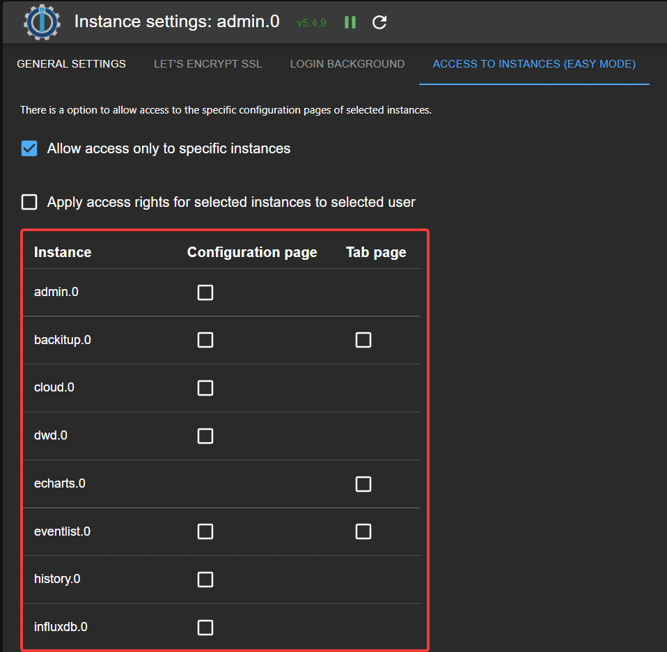

# ioBroker JSON Config component for Admin
This component is used for admin setting.



## How to use
Build process creates files in directory build.

All files from `build/admin` folder must be in adapter admin directory. 

To use this component in admin, add to jsonConfig.json file:
```json
    "accessAllowedConfigs": {
      "type": "custom",
      "i18n": true,
      "url": "custom/customComponents.js",
      "name": "AdminComponentEasyAccessSet/Components/ConfigCustomEasyAccess"
    }
```

Explanation: 
- `AdminComponentEasyAccessSet` - is unique name of this set of components
- `Components` - file name where all components are
- `ConfigCustomEasyAccess` - name of component in `Components.js`which must be used.
- `i18n` - if set to `true`, so the admin will load language files from `i18n`directory (in the same directory, where `customComponents.js` is), if set to language object, it will be used directly. Example: `{"easyconfig_text": {"en": "Text"}}`.

<!--
	### **WORK IN PROGRESS**
-->
## Changelog
### **WORK IN PROGRESS**
* (bluefox) Migrated to TypeScript

### 1.0.11 (2024-12-06)
* (bluefox) Updated packages

### 1.0.8 (2024-10-11)
* (bluefox) Updated `@iobroker/adapter-react-v5`

### 1.0.1 (2024-07-14)
* (bluefox) Updated for Admin 7

### 0.3.2 (2022-06-17)
* (bluefox) Corrected issue with a version of common packages

### 0.2.0 (2022-06-15)
* (bluefox) Changed builder to webpack

### 0.1.1 (2022-06-01)
* (bluefox) Added map files

### 0.0.2 (2022-05-26)
* (bluefox) Added i18n

## License
The MIT License (MIT)

Copyright (c) 2021-2025 bluefox <dogafox@gmail.com>

Permission is hereby granted, free of charge, to any person obtaining a copy
of this software and associated documentation files (the "Software"), to deal
in the Software without restriction, including without limitation the rights
to use, copy, modify, merge, publish, distribute, sublicense, and/or sell
copies of the Software, and to permit persons to whom the Software is
furnished to do so, subject to the following conditions:

The above copyright notice and this permission notice shall be included in
all copies or substantial portions of the Software.

THE SOFTWARE IS PROVIDED "AS IS", WITHOUT WARRANTY OF ANY KIND, EXPRESS OR
IMPLIED, INCLUDING BUT NOT LIMITED TO THE WARRANTIES OF MERCHANTABILITY,
FITNESS FOR A PARTICULAR PURPOSE AND NONINFRINGEMENT. IN NO EVENT SHALL THE
AUTHORS OR COPYRIGHT HOLDERS BE LIABLE FOR ANY CLAIM, DAMAGES OR OTHER
LIABILITY, WHETHER IN AN ACTION OF CONTRACT, TORT OR OTHERWISE, ARISING FROM,
OUT OF OR IN CONNECTION WITH THE SOFTWARE OR THE USE OR OTHER DEALINGS IN
THE SOFTWARE.
